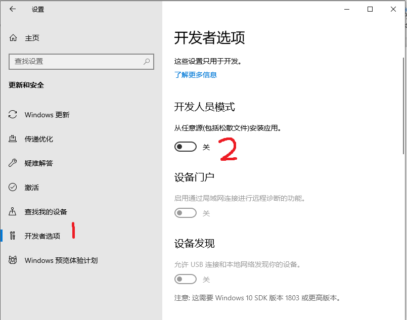
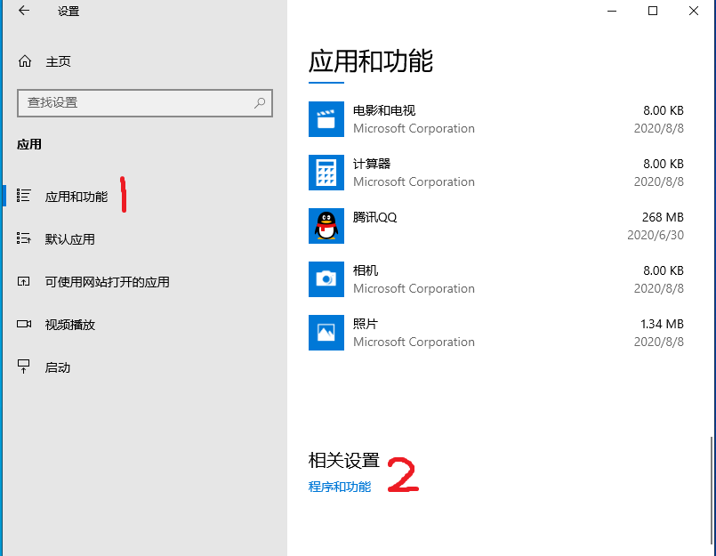
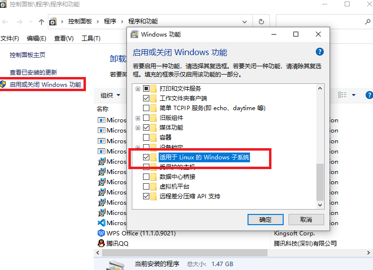
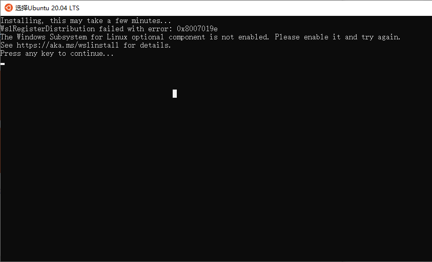
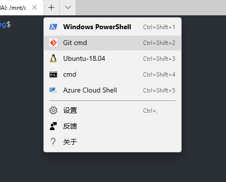
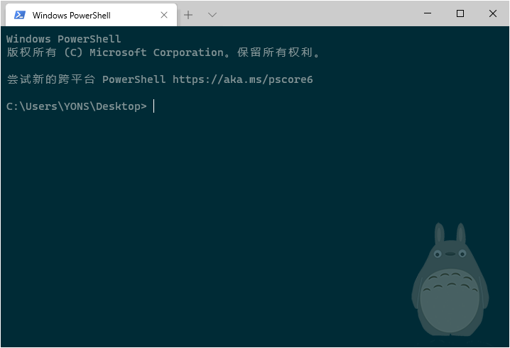
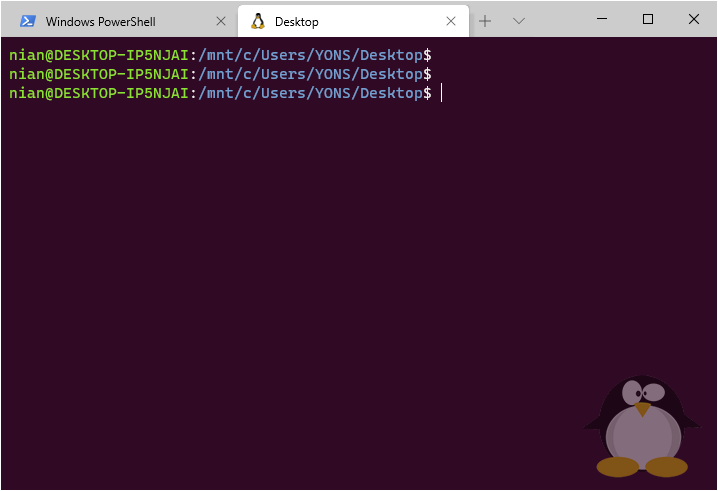
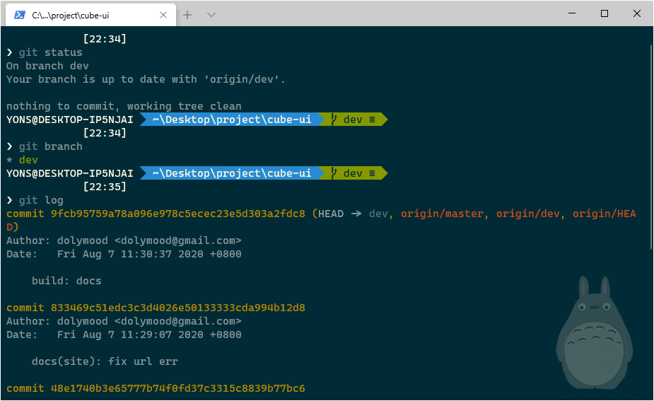

# 使用 Windows 终端和 WSL

## 安装 Windows Terminal
在windows 的应用商店下载安装 [Windows Terminal](https://www.microsoft.com/zh-cn/p/windows-terminal/9n0dx20hk701?rtc=1&activetab=pivot:overviewtab)

## 安装 WSL Ubuntu

1. 开始 --> 设置 --> 更新和安全 --> 开发者选项 --> 开发人员模式



2. 设置 --> 应用 --> 程序和功能




然后按提示重启电脑。

3. 下载 Ubuntu

在windows 的应用商店下载安装 [ubuntu](https://www.microsoft.com/zh-cn/p/ubuntu-2004-lts/9n6svws3rx71#activetab=pivot:overviewtab)

4. 启动 Ubuntu
如果第2步没有重启电脑，打开 Ubuntu 可能会出错


启动后，输入用户名和密码，就可以使用 Ubuntu 了。
此时打开 Windows Terminal，也**自动有 Ubuntu 的选项**了。

## 把 Windows Terminal 添加到右键菜单

1. 准备内一个[图标](./file/icon\terminal.ico)，放到一个指定的目录下， 如 "C:\win10\icon\terminal.ico"

2. 新建一个文本文件，后缀名改为reg，注意使用ANSI编码，内容如下:

```
Windows Registry Editor Version 5.00
 
[HKEY_CLASSES_ROOT\Directory\Background\shell\wt]
@="此处打开 Windows terminal"
"Icon"="C:\\win10\\icon\\terminal.ico"
 
[HKEY_CLASSES_ROOT\Directory\Background\shell\wt\command]
@="C:\\Users\\Administrator\\AppData\\Local\\Microsoft\\WindowsApps\\wt.exe"
```
**注意路径**中的用户， 需使用自己电脑用户名。

双击运行reg，提示已经添加到注册表。此时在任意的文件夹中，右键菜单中都有“此处打开 Windows terminal”选项了。


虽然能打开终端，但是路径并不是当前路径，需要修改配置：
打开 Windows Terminal --> 设置，给 profiles.defaults 加上这么一句：

```
"startingDirectory": null
```

## 添加 git bash

给 profiles 添加一项：
```json
{
    "closeOnExit": true,
    "commandline": "\"%PROGRAMFILES%\\git\\usr\\bin\\bash.exe\" -i -l", // gitbash的命令行所在位置
    "guid": "{1c4de342-38b7-51cf-b940-2309a097f589}", // 唯一的标识
    "historySize": 9001,
    "icon": "C:\\win10\\imgs\\icons\\git.png", // git的图标，打开终端时候会看到
    "name": "Git cmd" // tab栏的标题显示
}
```



## 设置主题
[这里](https://github.com/mbadolato/iTerm2-Color-Schemes/tree/master/windowsterminal) 有很多的主题。


例如，设置一个 windows Terminal 自带的主题 “Solarized Dark”，并且在右下角添加一个龙猫的小图片，配置如下：

```json
{
    // Make changes here to the powershell.exe profile.
    "guid": "{61c54bbd-c2c6-5271-96e7-009a87ff44bf}",
    "name": "Windows PowerShell",
    "commandline": "powershell.exe",
    "colorScheme": "Solarized Dark",
    "hidden": false,
    "backgroundImage": "C:\\win10\\imgs\\WindowsTerminal\\totoro.png",
    "backgroundImageAlignment": "bottomRight",
    "backgroundImageOpacity": 0.3,
    "backgroundImageStretchMode": "none"
}
```

效果如下：


例如，给 WSL 设置一个 Ubuntu 主题，并且在右下角添加一个企鹅的小图片，配置如下：

```json
{
    "guid": "{c6eaf9f4-32a7-5fdc-b5cf-066e8a4b1e40}",
    "hidden": false,
    "name": "Ubuntu-20.04",
    "source": "Windows.Terminal.Wsl",
    "colorScheme": "Ubuntu",
    "backgroundImage": "C:\\win10\\imgs\\WindowsTerminal\\linux.png",
    "backgroundImageAlignment": "bottomRight",
    "backgroundImageOpacity": 0.4,
    "backgroundImageStretchMode": "none"
}
```

同时需要设置 schemes：
```json
{
    "name": "Ubuntu",
    "black": "#2e3436",
    "red": "#cc0000",
    "green": "#4e9a06",
    "yellow": "#c4a000",
    "blue": "#3465a4",
    "purple": "#75507b",
    "cyan": "#06989a",
    "white": "#d3d7cf",
    "brightBlack": "#555753",
    "brightRed": "#ef2929",
    "brightGreen": "#8ae234",
    "brightYellow": "#fce94f",
    "brightBlue": "#729fcf",
    "brightPurple": "#ad7fa8",
    "brightCyan": "#34e2e2",
    "brightWhite": "#eeeeec",
    "background": "#300a24",
    "foreground": "#eeeeec"
}
```

效果如下：


## 设置 Powerline

参照[文档很容易搞](https://docs.microsoft.com/zh-cn/windows/terminal/tutorials/powerline-setup)





# 参考
* [官方文档](https://docs.microsoft.com/zh-cn/windows/terminal/)
* [oh-my-posh themes](https://github.com/JanDeDobbeleer/oh-my-posh#themes)
* [改变 powershell 的执行策略](https://blog.csdn.net/u010263423/article/details/107715219)